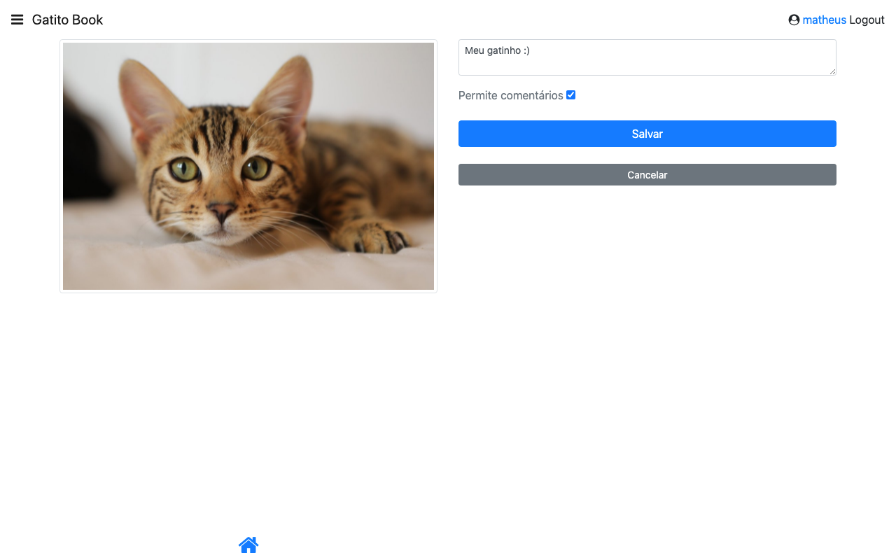

# GatitoBook - Projeto dos cursos de Angular da Alura

Este é o projeto criado nos cursos listados abaixo, na plataforma de estudos da [Alura](https://www.alura.com.br/).

- [Angular: Começando com o framework](https://www.alura.com.br/curso-online-angular-comecando-framework)
- [Angular: Boas práticas em arquiteturas e formulários](https://www.alura.com.br/curso-online-angular-boas-praticas-arquiteturas-formularios)
- [Angular: Controle o fluxo de navegação](https://cursos.alura.com.br/course/angular-controle-fluxo-navegacao)

### Motivação

Buscando certificações e também aprimoramento dos estudos; evolução com o framework, focando em completar as formações dessa excelente plataforma de estudos da Alura.

### Tópicos abordados

- Utilizar os recursos do framework para acelerar o desenvolvimento;
- Criação de componentes Angular;
- Como transmitir informação entre componentes;
- Integrar dados com API’s REST;
- Transformar componentes em páginas;

- Como começar um projeto com melhores validações de tipos utilizando o modo strict;
- Organizar melhor o projeto Angular utilizando módulos;
- Melhorar a performance da aplicação com o Lazy Loading;
- Criar formulários simples com módulo de Formulários Template Driven;
- Criar formulários elaborados utilizando o módulo de Formulários Reativos;
- Desenvolver validações síncronas e assíncronas para os formulários;
- Como utilizar token JWT no projeto Angular;

- Como utilizar a composição para criar componentes reutilizáveis e melhorar a produtividade;
- Como realizar a operação de upload de fotos no front-end;
- Otimizar o site utilizando serviços do tipo Resolver;
- Controlar o fluxo de navegação do usuário com guarda de rotas;
- Manipular as requisições da aplicação criando serviços do tipo Interceptor.

### Execução do projeto

O projeto foi criado com o [Angular CLI](https://github.com/angular/angular-cli) versão 11.2.11.
Após o clone do repositório, executar os comandos:

```bash
# instalação das depêndencias
$ sudo npm install

# execução em modo de desenvolvimento
$ ng serve
```

Também é necessário executar o "servidor", uma API que se encontra na pasta `/api` com:

```bash
$ npm start
```

### Screenshots

**1. Login**


---

**2. Página inicial - listagem de fotos**


---

**3. Menu aberto**


---

**4. Página interna da foto, com curtidas, comentários, botão para exclusão e formulário para novo comentário**


---

**5. Formulário cadastro nova foto**


---

**6. Formulário cadastro nova foto (após selecionar a foto)**


---

## Autor

- Website - [Matheus B. Grigoletto](https://matheusgrigoletto.com)
- [LinkedIn](https://www.linkedin.com/in/matheus-grigoletto/)
